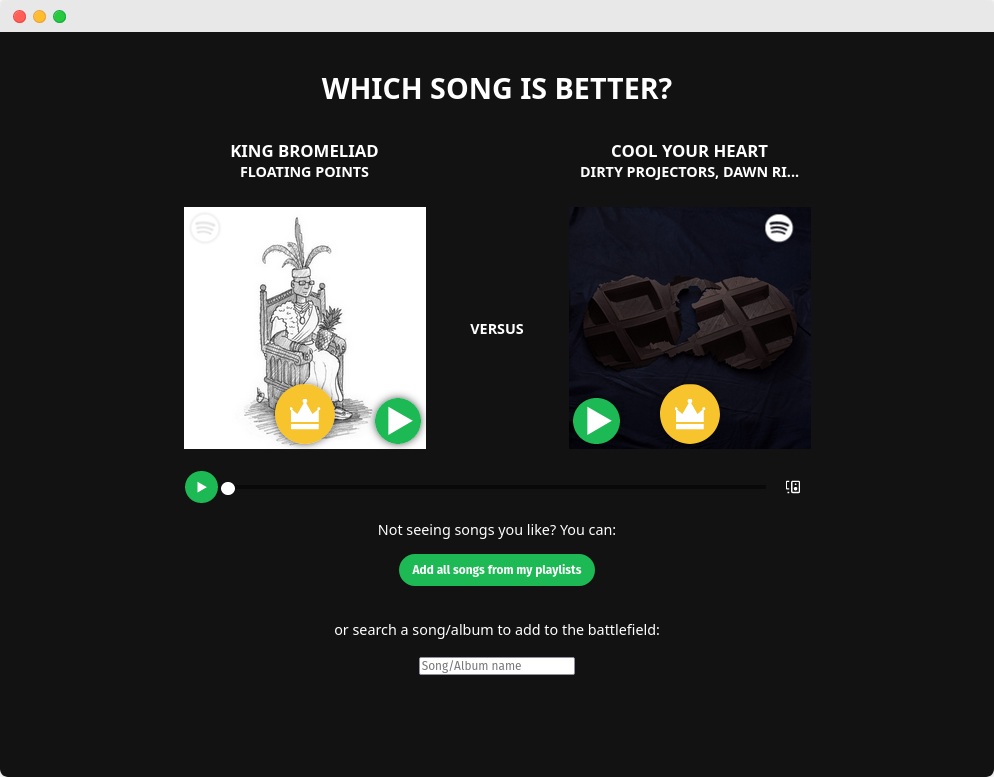

# spattle

> Spotify Battle to determine the best song of all time



> **NOTE**: This project is discontinued, and only works with NodeJS 14

## Build Setup

```bash
# install dependencies
npm install

# serve with hot reload at localhost:8080
npm run dev

# build for production with minification
npm run build
```

For detailed explanation on how things work, consult the [docs for vue-loader](http://vuejs.github.io/vue-loader).
